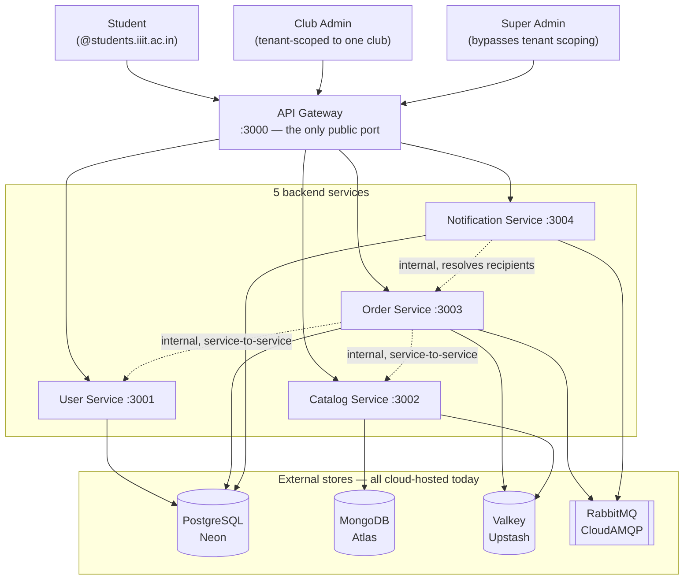

# System Context

Three actors, one entry point. Every request — regardless of role — goes through the API Gateway; nothing is ever allowed to call a backend service directly from a browser.

A few things this diagram is intentionally explicit about, because they're easy to get wrong when explaining this system out loud:

- **The three roles are one `users` table, not three systems.** `role` is just a column (`STUDENT` / `CLUB_ADMIN` / `SUPER_ADMIN`), enforced at the gateway (`services/api-gateway/middleware/rbacMiddleware.js`) and re-checked per-route in the owning service. There's no separate admin backend.
- **Order Service talks to User Service and Catalog Service directly**, bypassing the gateway, using a shared `X-Internal-Service-Key` header instead of a JWT. This is a deliberate trust boundary, not an oversight — see [jwt-and-rbac.md](../LLD/auth-and-access-control/jwt-and-rbac.md) for why that's safe.
- **Notification Service reaches back into Order Service** (`GET /by-item/:catalogItemId/users`) to resolve who should be notified about a delivery-slot change, rather than Order Service pushing that information onto the event itself. This keeps Order Service from needing to know anything about notification recipients — see the "why HTTP, not a second RabbitMQ hop" note in [saga-rollback.md](../LLD/saga-and-compensation/saga-rollback.md)'s neighboring concern, `strategy-observer-pattern.md`.
- **Every store shown is cloud-hosted right now**, reached over TLS from whichever machine is running the services. There is no local Postgres/Mongo/Valkey/RabbitMQ container — see [04-deployment-current-vs-planned.md](04-deployment-current-vs-planned.md) for what that means for latency and for the Docker work still to come.
