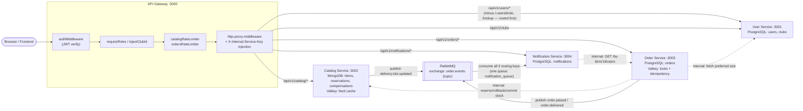

# Service Architecture

This diagram is drawn directly from the gateway's actual proxy table in `services/api-gateway/index.js`, not from the planning docs — the two mostly agree, but the gateway file is the source of truth for exact routes and ports.

Three routing details worth knowing cold, because they're the kind of thing that sounds like a bug until you see the reasoning:

1. **`PUT /api/v1/users/:userId/role` and `GET /api/v1/users/lookup` are registered *before* the general `/api/v1/users` proxy**, with their own `pathRewrite`. Express matches `app.use()` mounts in registration order — if the general proxy were registered first, it would swallow both routes before the `SUPER_ADMIN`-only checks ever ran.
2. **`/register` and `/login` are deliberately excluded from the auth-required path list** (`PROFILE_ACCESS_ROUTES` in `index.js`) — there's no JWT to check at the point someone is trying to log in. Auth is scoped to exactly `PUT /profile`, `PUT /size`, and `GET /profile/:userId`, not the whole `/api/v1/users` prefix.
3. **Order Service and Notification Service both make internal HTTP calls that skip the gateway entirely.** They authenticate to each other with the same `X-Internal-Service-Key` the gateway injects, not a JWT — a JWT represents *a user's* identity, and these calls aren't on behalf of a specific incoming request in the same way. See [jwt-and-rbac.md](../LLD/auth-and-access-control/jwt-and-rbac.md).

For the store choices themselves (why Postgres for orders/users, why Mongo for catalog, why Valkey does two unrelated jobs) see [polyglot-persistence.md](../LLD/data-modeling/polyglot-persistence.md) — this file is about routing and ownership, not the "why" of each store.
