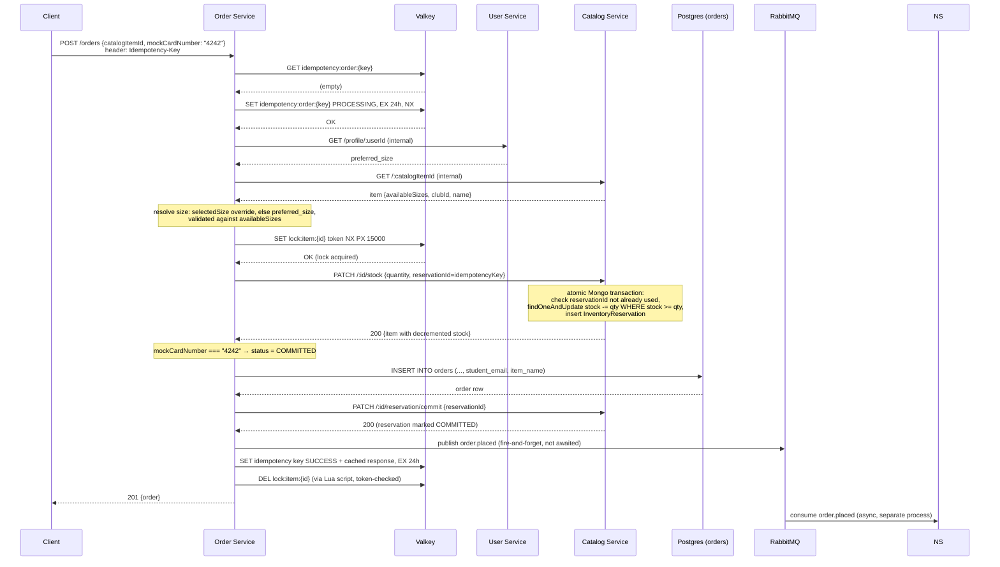
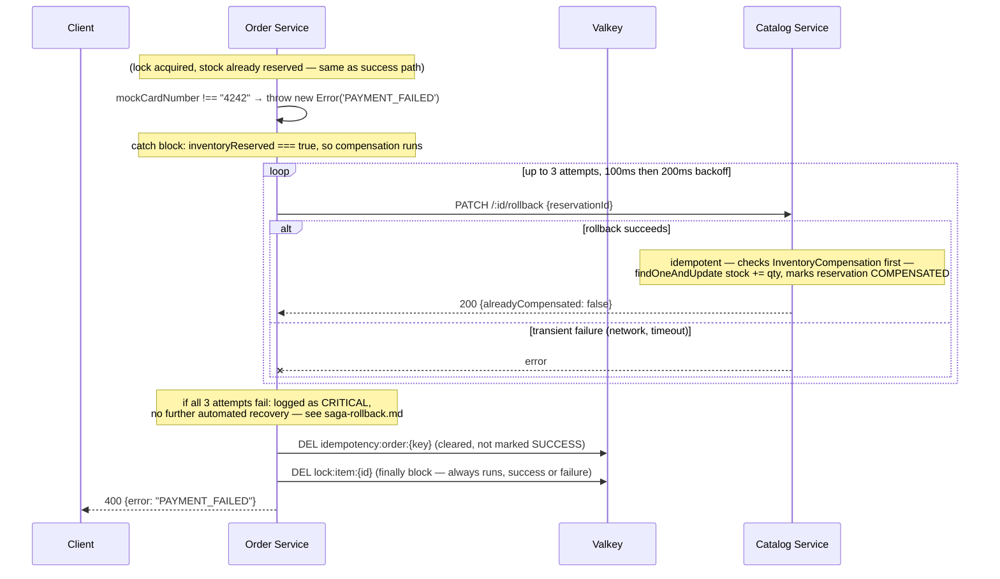

# Request Lifecycle: Checkout

This is the single most interview-relevant diagram in the repo — it's the one flow that touches almost every distributed-systems mechanism in the project (lock, idempotency, saga, three services, one message broker) in one request. It's built directly from `services/order-service/routes/orders.js`, `POST /` — line references below point there unless noted.

## The success path (`mockCardNumber: "4242"`)

## The failure path (`mockCardNumber: "4000"` or blank)

Everything up to the stock reservation is identical. The divergence happens right after `PATCH /:id/stock` succeeds — the code deliberately reserves stock *before* evaluating payment, which is exactly what makes a compensating transaction necessary at all.

Three things about this flow that are easy to get wrong when explaining it from memory:

- **The lock is released in a `finally` block**, so it's released whether the request succeeds, fails at payment, or fails at any earlier step (`orders.js` lines ~478–485). This is what makes the lock safe to reason about — there's exactly one place it's released, not one per exit path.
- **Idempotency and locking are solving different problems and are checked at different points.** The idempotency check happens *before* the lock is even attempted (a retried request with the same key should never re-enter the flow at all). The lock is scoped to the *item*, not the request — two different students checking out the same item both pass the idempotency check (different keys) but only one gets the lock. See [idempotency.md](../LLD/concurrency-control/idempotency.md) for the sharp version of this distinction.
- **A failed compensation doesn't roll anything back further.** If all 3 rollback attempts fail, the code logs `CRITICAL` and returns `400` to the client anyway — the student correctly sees "payment failed," but the inventory count is now wrong until someone intervenes manually. This is a real, acknowledged gap, not a hidden one — see [saga-rollback.md](../LLD/saga-and-compensation/saga-rollback.md).
