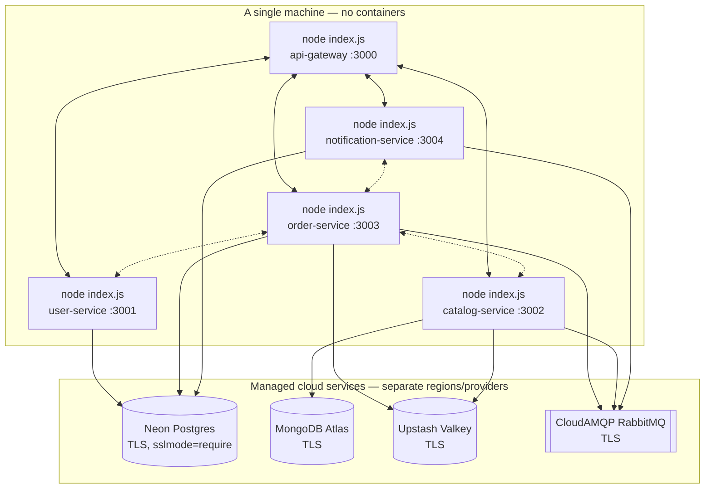
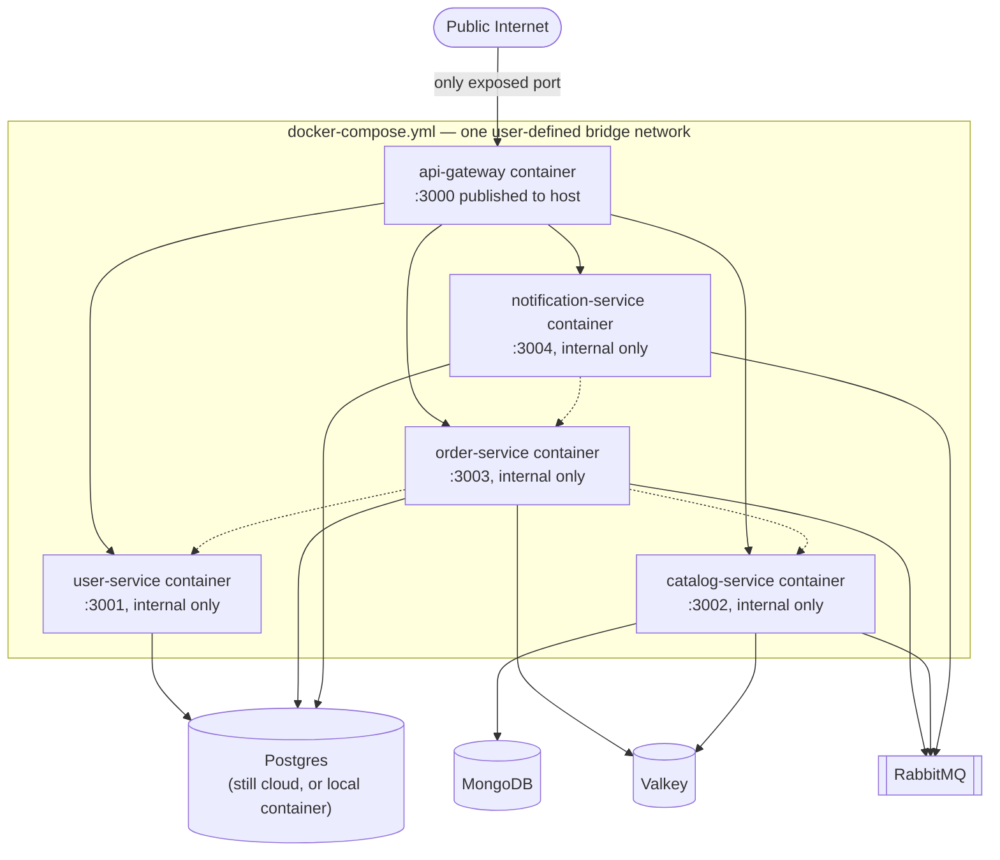

# Deployment: Current vs. Planned

These two states are kept on separate diagrams deliberately. Blurring "what's running" and "what's designed" together is exactly how a planning doc ends up quoted as fact in an interview when it was never actually true — see the KPI section of `docs/PRD.md` for a case where that already happened once in this project.

## Current (what's actually running)

- All 5 services are plain `node index.js` processes on one machine (`npm run dev` at the repo root runs all 5 via npm workspaces + `concurrently`), talking to each other over `localhost` with hardcoded ports (`http://localhost:3001`, etc. — see `process.env.USER_SERVICE_PORT || 3001` patterns throughout).
- Every datastore is a managed cloud service, reached over the public internet with TLS. This is *why* the measured cache-hit numbers in [catalog-feed-cache.md](../LLD/caching/catalog-feed-cache.md) are dominated by network round-trip time rather than actual cache-lookup cost — there is no "local network" for these services to share yet.
- There is no reverse proxy, no container runtime, and no private network boundary today. Anyone with `localhost` access to the machine can hit `:3001`–`:3004` directly, bypassing the gateway entirely — the `X-Internal-Service-Key` check on each service (`internalAuthMiddleware`) is the only thing stopping that, not network isolation.

## Planned (Phase 2, not yet built)

- Only the gateway's port would be published to the host; every other service would be reachable only by container DNS name on the internal bridge network (`http://order-service:3003` instead of `http://localhost:3003`) — this is the one concrete code change this migration requires beyond the Dockerfiles themselves, since every internal call is currently hardcoded to `localhost`.
- Whether the databases move into the compose file too, or stay on the managed cloud tiers, is an open choice — `docs/ADR.md` (ADR-002/003/004) argued for the cloud tiers specifically to avoid local resource overhead during *development*; that reasoning doesn't automatically carry over to a deployed environment, where co-locating at least Valkey (for lock/cache latency) would likely be worth revisiting.
- **Status: not built.** No `Dockerfile` or `docker-compose.yml` exists in this repo as of this writing. This is tracked as upcoming work, not partially-done work.
