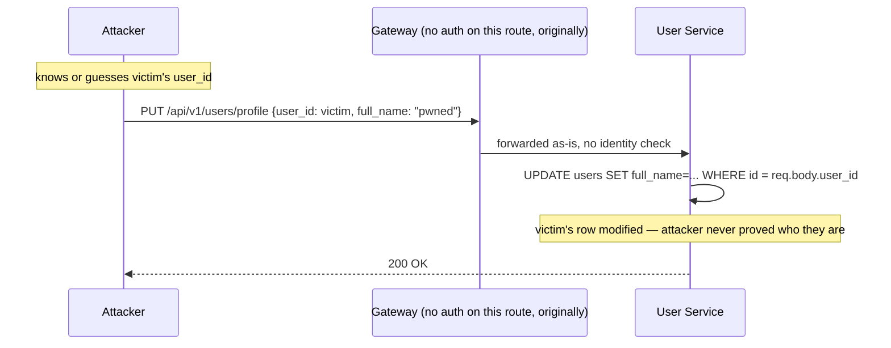
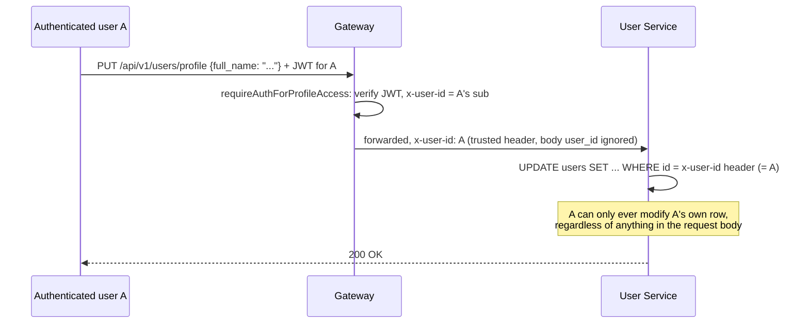

# Case Study: The Profile IDOR

Source: `learnings.md` #3. This is the single strongest piece of security material in this repo — a real vulnerability, found through actual testing, fixed with a specific mechanism, and verified with a specific reproduction. Know this one cold.

## The vulnerability

`PUT /profile` and `PUT /size` (user-service) originally read `user_id` **straight from the request body** and updated that row — with **no authentication middleware at all** on the gateway's `/api/v1/users` prefix. The combined effect: any caller, authenticated or not, could edit *any other user's* profile or preferred size simply by putting a different `user_id` in the JSON body:

```
PUT /api/v1/users/profile
{ "user_id": "<victim's uuid>", "full_name": "pwned" }
```

This is a textbook **Insecure Direct Object Reference (IDOR)** — the vulnerability class where an application uses a client-supplied identifier to look up or modify a resource without verifying the caller is actually authorized to touch *that specific* resource. The identifier itself (`user_id`) wasn't secret or hard to guess in any meaningful sense — the real bug is that the server never checked whether the caller *was* that user in the first place.



## The constraint that shaped the fix

The naive fix — "just require auth on `/api/v1/users`" — doesn't work as a blanket rule, because `/register` and `/login` live under that same prefix and **must** stay public: there is no JWT to check at the point someone is trying to log in for the first time. The fix had to be scoped to exactly the routes that represent "act on my own account," not the whole prefix.

## The fix

A small gateway-side middleware (`requireAuthForProfileAccess` in `services/api-gateway/index.js`) matches only `PUT /profile`, `PUT /size`, and `GET /profile/:userId` against method+path patterns. For exactly those routes, it runs `authMiddleware` (JWT verification) and then injects `x-user-id: req.user.sub` — the verified JWT's own subject claim — as a trusted header:

```js
const requireAuthForProfileAccess = (req, res, next) => {
    const needsAuth = PROFILE_ACCESS_ROUTES.some(
        route => route.method === req.method && route.pattern.test(req.path)
    );
    if (!needsAuth) return next();
    return authMiddleware(req, res, () => {
        req.headers['x-user-id'] = req.user.sub;
        next();
    });
};
```

User Service now reads identity from `x-user-id` **only** — `req.body.user_id` is no longer read anywhere in the update handlers. `GET /profile/:userId` goes one step further and actively checks the path parameter against the trusted header: `if (authenticatedUserId !== userId) return 403` — so even the *read* path can't be used to view someone else's profile by putting their id in the URL.



## How it was verified

Registered two accounts (A and B). Logged in as A, called `PUT /profile` and `PUT /size` with **B's `user_id`** placed in the request body — the update landed on **A's own row** every time; B's row was untouched, because the body value is never read at all anymore. Called with no token → `401`. Confirmed `/register` and `/login` still work fully unauthenticated, proving the fix didn't over-scope and accidentally lock out the routes that need to stay public.

## Why this is worth walking through carefully in an interview

It demonstrates the actual general principle, not just one fixed bug: **for any "act on my own account" endpoint, identity must come from something the caller cannot forge (a verified token), and it must be injected downstream as a header the client never controls — never re-read from client-suppliable input (body, query, or URL params) at any point in the chain.** The `GET /profile/:userId` fix is worth mentioning specifically because it shows the same principle applied even where there's an id *in the URL* that looks like it should be the source of truth — it isn't; the header is.

## What was rejected, and why

Scoping auth to the entire `/api/v1/users` prefix (simpler to write) was rejected because it would break `/register` and `/login`, which must remain reachable with no token. The chosen fix — a small allowlist of exact method+path patterns — is more code than a blanket prefix check, but it's the only version that's both secure and doesn't break login itself.
