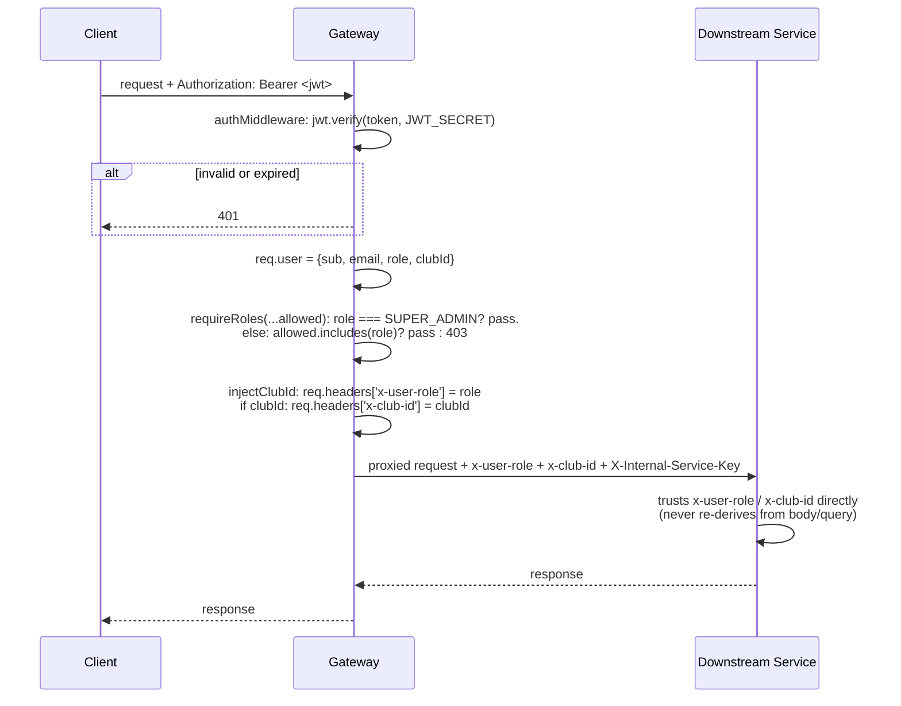

# JWT & RBAC Flow

**Where:** `services/api-gateway/middleware/authMiddleware.js` and `rbacMiddleware.js`.

## The problem it solves

Every downstream service needs to know *who* is calling and *what role* they have, without re-verifying a JWT signature on every single internal hop, and without trusting anything the client could forge (a `userId` in a request body, a `clubId` in a query string). The gateway does the one JWT verification per request; everything downstream trusts gateway-derived headers instead.

## How it actually works

The JWT itself carries `sub` (user id), `email`, `role`, `clubId` — signed at login (`user-service/routes/auth.js`, `POST /login`) with a 1-hour TTL. `authMiddleware` verifies the signature and populates `req.user`; `requireRoles(...allowedRoles)` is a middleware *factory* — `requireRoles('CLUB_ADMIN')` returns a middleware checking exactly that — with one hardcoded universal exception: `if (role == 'SUPER_ADMIN') return next()` runs before the allowlist check, so Super Admin always passes regardless of which roles a given route names. `injectClubId` then writes `x-user-role` and `x-club-id` onto the outgoing request headers, sourced from `req.user` (the verified JWT), never from anything the client sent directly.

**Tenant isolation** is enforced downstream, not at the gateway: a Club Admin's `x-club-id` header is fixed to their own club, and each service's route handler compares that header against the resource being touched — e.g. `catalog.js`'s delivery-slot route: `if (role === 'CLUB_ADMIN' && item.clubId !== clubId) return 403`. The gateway's job is only to guarantee `x-club-id` reflects the *caller's actual club* — it can't itself know whether a specific Mongo item or Postgres order belongs to that club, since that's data each service owns.

**Why Super Admin bypasses `requireRoles` entirely, structurally:** rather than every route listing `SUPER_ADMIN` alongside whatever role it actually cares about (`requireRoles('CLUB_ADMIN', 'SUPER_ADMIN')` everywhere), the bypass is centralized once inside `requireRoles` itself. This means a route can be written as `requireRoles('CLUB_ADMIN')` and mean exactly what it says ("Club Admin, plus the universal admin") without every call site needing to remember to add `SUPER_ADMIN` to the list.

**Internal service-to-service calls skip this whole flow.** Order Service calling User Service directly (bypassing the gateway) authenticates with `X-Internal-Service-Key`, a shared secret, not a JWT — because that call isn't "acting as a specific logged-in user going through auth," it's "one trusted backend service asking another for data it needs to serve the original request." Order Service does still forward the *original caller's* identity where needed (setting `x-user-id` itself, copied from the JWT `sub` it already decoded) — see [idor-fix-case-study.md](idor-fix-case-study.md) for why that specific header is safety-critical.

## What was rejected, and why

Re-verifying the JWT at every downstream service (rather than trusting gateway-derived headers) was implicitly rejected — it would mean distributing `JWT_SECRET` to every service and re-running signature verification on every internal hop for no additional security benefit, since the gateway already sits in front of every path to those services in this deployment.

## Honest limit

The trust boundary here is only as strong as "nothing can reach `:3001`–`:3004` except through the gateway or with the internal key" — and today (see [04-deployment-current-vs-planned.md](../../HLD/04-deployment-current-vs-planned.md)), that's enforced entirely by the `X-Internal-Service-Key` check, not network isolation, since there's no private Docker network yet. Anyone with `localhost` access to the host machine and the key value could call a backend service directly.
