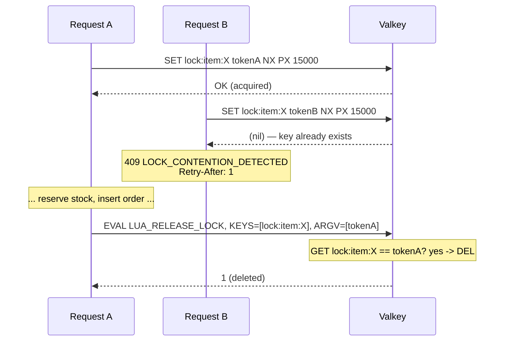

# Distributed Locking

**Where:** `acquireLock` / `releaseLock` in `services/order-service/routes/orders.js`, lines ~13–52.

## The problem it solves

Two students both click "Place Order" on the last unit of a hoodie within the same millisecond. Both requests read "stock: 1" before either has written anything back. Without mutual exclusion around the read-decide-write sequence, both could pass a naive `if (stock > 0)` check and both decrement — the classic lost-update race, and the exact scenario the entire project's "zero overselling" guarantee is built to prevent.

## How it actually works



**Acquiring:** `SET lock:item:{id} {randomToken} NX PX 15000` — `NX` means "only set if the key doesn't already exist," so this single command is the entire acquire-or-fail decision, atomically. `PX 15000` gives the lock a 15-second TTL (`LOCK_TTL_MS`), so a crashed process can never hold a lock forever.

**Releasing — the part that's easy to get wrong:** releasing is *not* a plain `DEL lock:item:{id}`. It's a Lua script:

```lua
if redis.call("GET", KEYS[1]) == ARGV[1] then
    return redis.call("DEL", KEYS[1])
else
    return 0
end
```

Why this matters: imagine request A acquires the lock, then stalls past the 15-second TTL (a slow downstream call, GC pause, whatever) — Valkey auto-expires the lock. Request B now acquires the *same* lock, with a *different* token, and starts doing its own work. If A then wakes up and blindly runs `DEL lock:item:X`, it would delete B's lock — a lock A no longer legitimately holds. The Lua script prevents this: A's release only succeeds if the value stored under the key is still *A's own token*. Since Redis/Valkey executes a Lua script as a single atomic unit, there's no window between the `GET` and the `DEL` where another client could interleave. Deletion by the wrong holder is what this check exists to prevent, not the delete itself.

**On contention:** if the `SET NX` returns `nil` (someone else holds it), the handler immediately clears the idempotency key it had already started setting (so the caller's retry with the same key isn't stuck behind a phantom `PROCESSING` state) and returns `409 LOCK_CONTENTION_DETECTED` with `Retry-After: 1`. The frontend treats this as retryable — the QA checklist documents the expected UI as "Retrying... (attempt X of 3)" before it either succeeds or gives up.

**Release always happens in a `finally` block**, so it runs on every exit path — success, payment failure, downstream error — not duplicated per branch.

## What was rejected, and why

- **Database-level row locking** (`SELECT ... FOR UPDATE` in Postgres) was considered and rejected in `docs/ADR.md` (ADR-002/003) for a structural reason: the resource actually being contended over (item stock) lives in *MongoDB*, not Postgres — there's no Postgres row to lock at the point contention happens. A Postgres-side lock could serialize the `orders` INSERT, but by then two requests could already have both decremented Mongo stock.
- **A plain `DEL`** on release was the first version of this code, and is the more obvious thing to write — it's wrong specifically under the TTL-expiry-then-reacquire race described above. This project didn't hit that race in practice (unlike the rate limiter's race — see [token-bucket-limiter.md](../rate-limiting/token-bucket-limiter.md), which *did* get hit live), but it's the standard reasoning for why a token-checked release is the correct default, not an optional refinement.

## Honest limit

`LOCK_TTL_MS` is a fixed 15 seconds, chosen as "comfortably longer than the checkout flow normally takes," not derived from a measured p99 latency. If the checkout flow's internal-service calls (user-service, catalog-service) ever got slow enough to approach 15s, a lock could still expire mid-request and get reacquired by someone else while the original request is still running — the token check protects the *release*, not the case where the original holder is still doing work past its own TTL. That's a real edge case worth naming if asked "what happens if 15 seconds isn't enough," not a solved problem.
