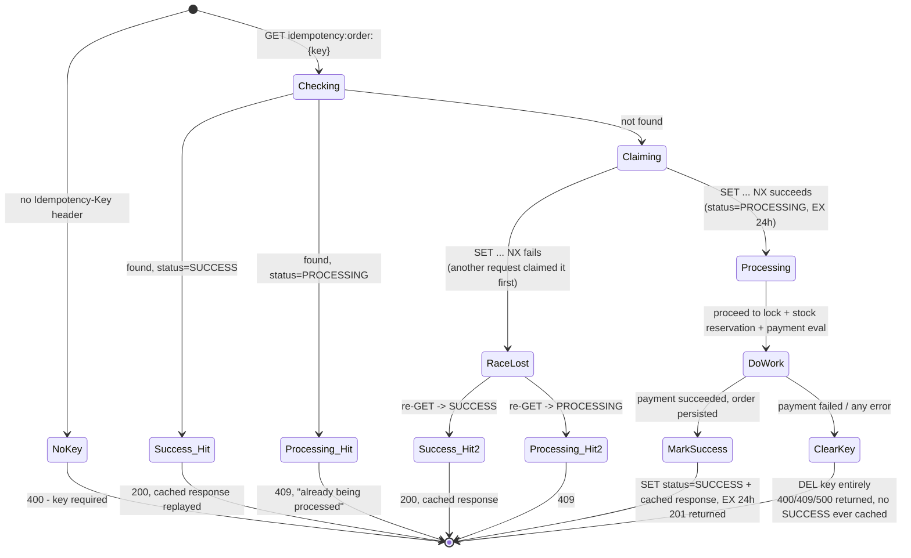

# Idempotency

**Where:** the `Idempotency-Key` handling in `services/order-service/routes/orders.js`, `POST /`, lines ~114–233.

## The problem it solves

A student clicks "Place Order," their network stalls, the client retries the same HTTP request (or the student double-clicks before the button disables). Without protection, that's two identical checkout attempts — two stock decrements, potentially two orders, for one intended purchase. This is a *different* failure mode from lock contention: it's the same logical request appearing twice, not two different requests genuinely competing for the same item. See [concurrency-control/README.md](README.md) for the sharp version of that distinction — it's worth stating explicitly because the two are easy to conflate.

## How it actually works

Three states: no key seen yet, `PROCESSING` (claimed, in flight), `SUCCESS` (completed, response cached for replay). There is deliberately no `FAILED` state — a failed attempt just deletes the key outright (`clearIdempotencyKey()` / the `catch` block's `redis.del(valkeyKey)`), so a retry with the same key after a genuine failure starts completely fresh rather than being permanently blocked by a stale failure record.

The claim step (`SET valkeyKey {status: PROCESSING} EX 86400 NX`) is where the actual race is handled: if two requests with the same idempotency key somehow arrive close enough together that both pass the initial `GET` check before either has claimed the key, the `NX` flag means only one `SET` can succeed. The loser re-reads the key (now populated by the winner) and returns either the cached `SUCCESS` response or a `409` for `PROCESSING`, rather than proceeding to do the work twice. This is the same "don't check-then-act across two separate calls" principle the rate limiter's bug (see [token-bucket-limiter.md](../rate-limiting/token-bucket-limiter.md)) violated and had to be fixed for — here it's handled correctly from the start.

The 24-hour TTL (`IDEMPOTENCY_TTL = 86400`) is chosen to comfortably outlast any plausible retry window (network retries, a student re-opening a stuck tab) while still eventually freeing the key.

## What was rejected, and why

A unique database constraint alone (the `orders_idempotency_key_unique` partial index added in `migrate4.js`) *is* present as a defense-in-depth backstop, but is not the primary mechanism — relying on it alone would mean a retried request still runs the entire checkout flow (lock, stock reservation, payment eval) before failing at the final `INSERT`, which is far more wasteful than rejecting the duplicate at the very first step, and — worse — would mean a retry that reaches the stock-reservation step a second time before the DB constraint catches it at insert time, which could still transiently double-reserve inventory. The Valkey-based check-early approach avoids that class of problem entirely by rejecting duplicates before any side effect happens.

## Honest limit

The `PROCESSING` state has no automatic recovery if the process crashes mid-request after claiming the key but before either succeeding or hitting the `catch` block — the key would sit in `PROCESSING` for the full 24-hour TTL, and a legitimate retry during that window would incorrectly get a `409` instead of being allowed to proceed. This hasn't been observed in practice, but it's a real gap: there's no separate, shorter "in-flight" timeout distinct from the full 24-hour idempotency window.
