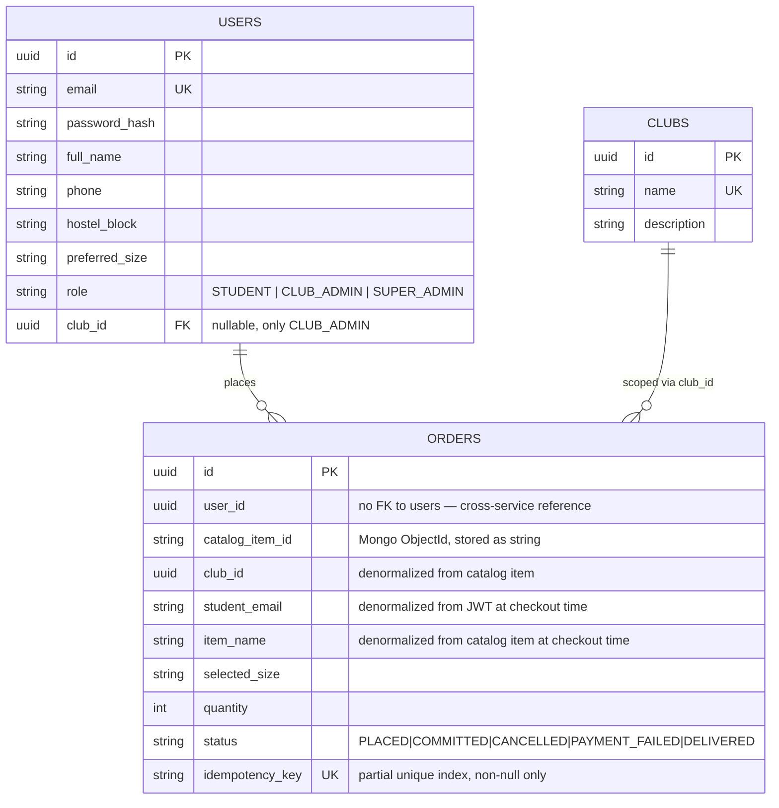
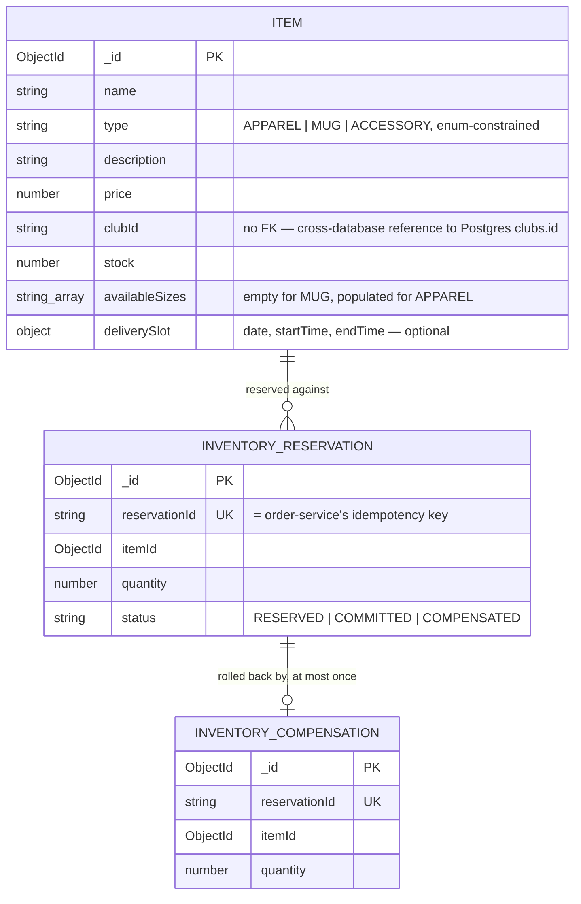

# Polyglot Persistence — Schema Detail

**Where:** `services/order-service/db/*.js` (migrations) for Postgres; `services/catalog-service/models/Item.js` for Mongo.

## Why two engines at all

Two different data shapes with two different consistency needs, argued in `docs/ADR.md` ADR-002 at the architecture level — this doc goes one level deeper, into the actual schemas.

**The catalog problem:** an Apparel item needs `availableSizes`; a Mug needs none of that but might carry a `volume_ml` (via Mongoose's `strict: false`, allowing arbitrary extra fields per document); an Accessory sits somewhere in between. Modeling this relationally means either a rigid schema with mostly-null columns, or Entity-Attribute-Value tables (a generic `attribute_name`/`attribute_value` table) that turn every query into a pivot. MongoDB's document model stores each item's actual shape directly, with the schema `strict: false, timestamps: true` deliberately keeping only the fields *every* item type shares as required (`name`, `type`, `price`, `clubId`, `stock`) and letting type-specific fields ride along ungoverned by Mongoose validation.

**The checkout problem:** order state needs ACID guarantees and predictable behavior under concurrent writes — many students hitting checkout on the same item at once. PostgreSQL's row-level locking and MVCC handle concurrent access to the same logical resources far more predictably than a document database's optimistic concurrency model would under this specific access pattern (many small, contended writes to a shared counter).

**Note what's *not* there:** `orders.catalog_item_id` references a Mongo document by string id, and `Item.clubId` references a Postgres row by string id — neither is a real foreign key, because Postgres and MongoDB can't enforce a constraint across engines. This is the concrete cost named in ADR-002's "Negative" consequences (`Cross-Engine Consistency`): referential integrity across the two stores is an application-level responsibility, not a database-enforced one.

## Three denormalized columns on `orders`, and why each one exists

`club_id`, `student_email`, and `item_name` were all added to `orders` *after* the table already existed (migrations 6, 7, 8), each with the identical shape: nullable column added, a one-off backfill script (`backfillClubId.js`, etc.) populates existing rows, and the checkout `INSERT` starts including the value going forward.

The reasoning (`learnings.md` #6 and #7), generalized: **before reaching for a new endpoint or a cross-service lookup to resolve "id → readable info," check whether the writer already had that info in hand at write time.** In all three cases, the checkout handler already has the value sitting in local variables it fetched or decoded for other reasons — `item.clubId` (already fetched from Catalog Service to resolve sizes), `decoded.email` (already decoded from the caller's own JWT), `item.name` (from the same catalog fetch) — before it ever chose to persist them. Writing them into the row at insert time means every future read (`GET /orders`, `GET /orders/club`) is free: no join, no cross-service HTTP call, no new permission-scope question about who's allowed to resolve a `user_id` into an email.

That last point mattered concretely for `student_email`: the alternative was a new `GET /users/by-ids` batch lookup, which would have forced a decision about whether Club Admins should be able to resolve arbitrary user info at all (today, only `SUPER_ADMIN` can, via the narrow `GET /users/lookup?email=`). Denormalizing sidesteps that question entirely — `student_email` is just another column on a row already scoped by `club_id`.

The tradeoff, stated honestly: a denormalized column is a **snapshot, not a live value** — if a student's email ever changed after placing an order, `orders.student_email` would still show the email at the time of purchase. `learnings.md` frames this as usually *correct* for this specific kind of record, not merely tolerable: "an order should show who placed it at the time, the same way a shipping label freezes a name at the moment of shipping." Denormalization also compounded once adopted — `item_name` (migration 8) reused the identical migrate/backfill pattern from `club_id` (migration 6), and in one case (`ClubOrdersPage.jsx`) actually let existing client-side lookup code be *deleted*, not just avoided a new lookup.

## What was rejected, and why

- **A relational catalog** (one `items` table, columns for every possible attribute across all item types) was rejected in ADR-002 for the EAV/`JSONB`-gymnastics reason above.
- **Live cross-service lookups instead of denormalization** (resolving `user_id` → email via a real-time call to User Service on every `GET /orders/club`) were rejected per-field, for the reasons in `learnings.md` #6/#7 above — mainly the added latency and the new permission-scope question, for data that's cheap to snapshot at write time and rarely needs to be perfectly live.

## Honest limit

Denormalization only remains correct as long as every write path that creates an `orders` row also populates these three columns — the backfill scripts exist specifically because pre-migration rows didn't have them, and any *future* code path that inserts into `orders` without going through the same checkout handler would need to remember to populate them too. There's no database-level constraint enforcing that these three columns are always kept in sync with their source of truth; it's a convention the codebase currently only has one write path to maintain.
