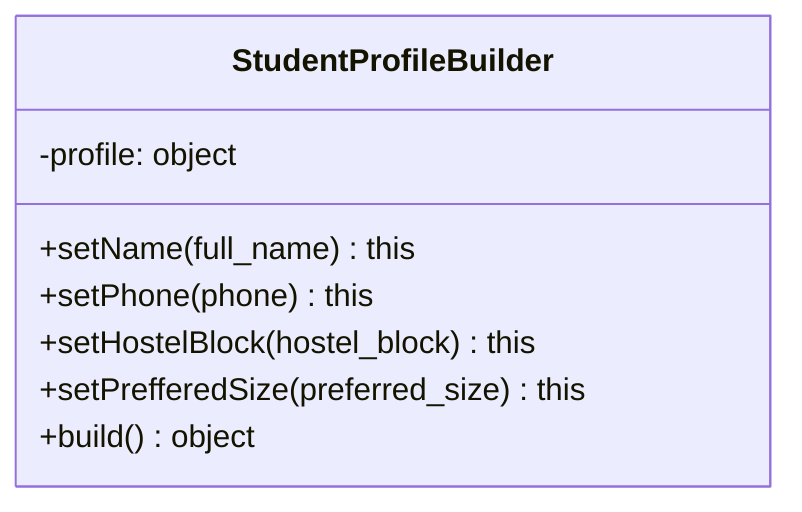

# Builder Pattern — Student Profile Construction

**Where:** `services/user-service/models/StudentProfileBuilder.js`, used by `PUT /profile` and `PUT /size` in `services/user-service/routes/auth.js`.

## The problem it solves

`PUT /profile` is a *partial* update — a student might send just `full_name`, or `phone` and `hostel_block` together, or all four fields at once. `preferred_size` additionally needs validation (`S`/`M`/`L`/`XL`/`XXL` only) that the other three fields don't need. The handler has to turn "whatever subset of fields showed up in `req.body`" into a clean object with only the present fields, validated, ready to feed into a dynamically-built SQL `UPDATE`.

## How it actually works



Each `set*` method mutates an internal `this.profile` object and returns `this`, enabling the fluent chain. The route only calls the setters for fields that actually arrived:

```js
const builder = new StudentProfileBuilder();
if (full_name) builder.setName(full_name);
if (phone) builder.setPhone(phone);
if (hostel_block) builder.setHostelBlock(hostel_block);
if (preferred_size) builder.setPrefferedSize(preferred_size);
const profile = builder.build();
```

`build()` returns `{ ...this.profile }` — only the keys that were actually set. The route then turns that into a dynamic `SET` clause (`fields.map((field, i) => \`${field} = $${i+1}\`).join(', ')`), so the SQL only touches columns that were actually provided. `setPrefferedSize` is the one setter that validates and throws (`Invalid size. Valid sizes are: ...`) — that's why it's the only one wrapped in error handling in the route (`err.message.startsWith('Invalid size')` → `400`).

`PUT /size` reuses the exact same builder for a single field: `new StudentProfileBuilder().setPrefferedSize(preferred_size).build()` — the builder isn't duplicated per-endpoint, it's the same validation path both routes go through.

## What was rejected, and why

The straightforward alternative is: build the object literally, inline, with a chain of `if` statements setting keys directly on a plain `{}`, and a separate `if` block for the size-validation check. That's not meaningfully worse for *this exact* set of four fields — the real justification here is that the validation rule (`preferred_size` must be one of five values) lives in exactly one place (`setPrefferedSize`) and both `PUT /profile` and `PUT /size` are guaranteed to go through it, rather than each route re-implementing (and potentially drifting on) the same size-list check.

## Honest limit

Four fields, one with validation, is a genuinely small case for the Builder pattern — this is closer to "the textbook shape of a Builder" than "the specific complexity that demands one." It reads clearly and it's real code (not a hollow demo), but a fair interview answer here is "yes, this could have been a plain function that returns a validated object" — the pattern's value shows up more as the profile grows more optional fields with more validation rules, which hasn't happened yet in this project.
