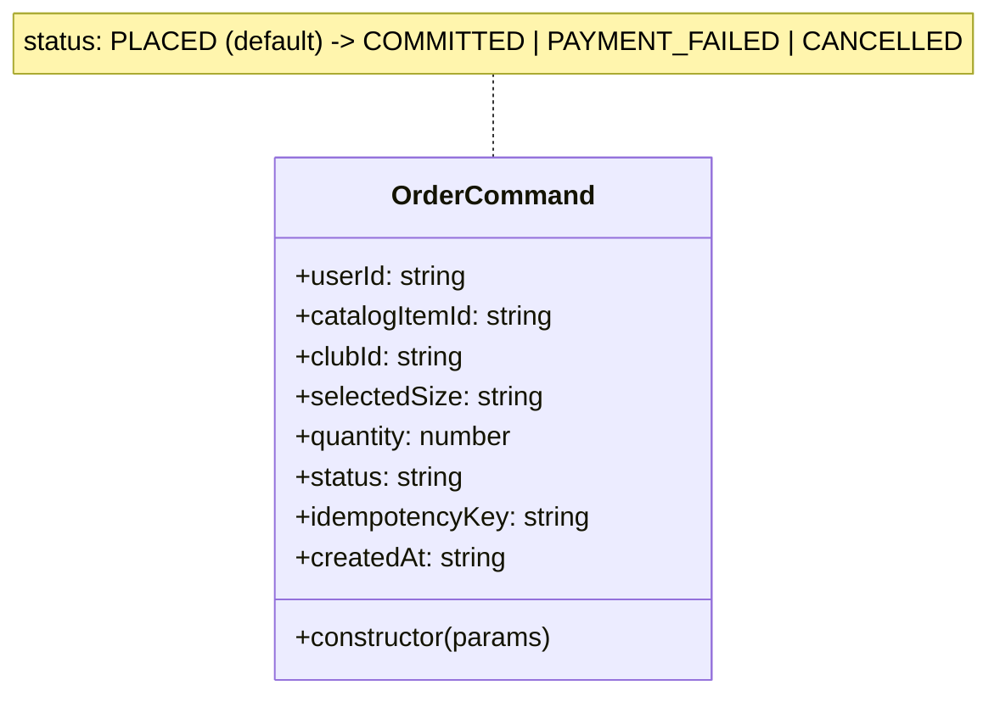

# Command Pattern — Order Encapsulation

**Where:** `services/order-service/models/OrderCommand.js`, constructed inside `POST /` in `services/order-service/routes/orders.js`.

## The problem it solves

By the time a checkout is ready to execute, the handler has gathered data from three different sources: the request body (`catalogItemId`, `quantity`, `selectedSize`), the JWT (`userId`), and a downstream service call (`item.clubId`, resolved size). `OrderCommand` is the single point where all of that is assembled into one validated object *before* any side effect (lock, stock reservation, DB insert) happens — instead of those fields floating around as loose local variables that a later line of code could accidentally use inconsistently.

## How it actually works



The constructor validates eagerly and throws on the spot for missing `userId`, missing `catalogItemId`, `quantity < 1`, missing `idempotencyKey`, or a `status` outside the known set — so a malformed command can never be constructed in the first place, rather than being caught later at the point it's used:

```js
const orderCommand = new OrderCommand({
    userId, catalogItemId, clubId: item.clubId,
    selectedSize: resolvedSize, quantity, idempotencyKey
});
// ... later, only after the lock is acquired and stock is reserved:
if (mockCardNumber === '4242') {
    orderCommand.status = 'COMMITTED';
}
```

Note what this *isn't*: there's no `execute()` method, no command queue, no undo/redo. This is a narrower use of the pattern than the textbook version — it's "Command" in the sense of "one object that fully represents an intended action," used here purely to centralize validation and give the checkout's data a name, not as a dispatchable/queueable unit of work.

## What was rejected, and why

The alternative is passing `userId`, `catalogItemId`, `clubId`, `selectedSize`, `quantity`, `idempotencyKey` around as six separate local variables (which, honestly, the handler still partly does alongside the command object — see the note below). The stated value of bundling them is that the validation (`quantity` must be a positive integer, `idempotencyKey` must exist, `status` must be a known value) happens in one constructor instead of being re-checked or, worse, silently skipped at each point one of these values is used.

## Honest limit

This is the pattern used most loosely of the four in this codebase. `orderCommand.status` is mutated in place after construction (`orderCommand.status = 'COMMITTED'`) rather than the command being immutable and a *new* command representing the committed state — a stricter Command implementation would treat status transitions as producing a new object, not mutating the existing one. It's fair to describe this as "a validated data-holder object named after the Command pattern" rather than a full command-dispatch system — which is a completely reasonable scope for what a single checkout endpoint needs, but worth being precise about if asked to defend it as a "true" Command pattern in an interview.
