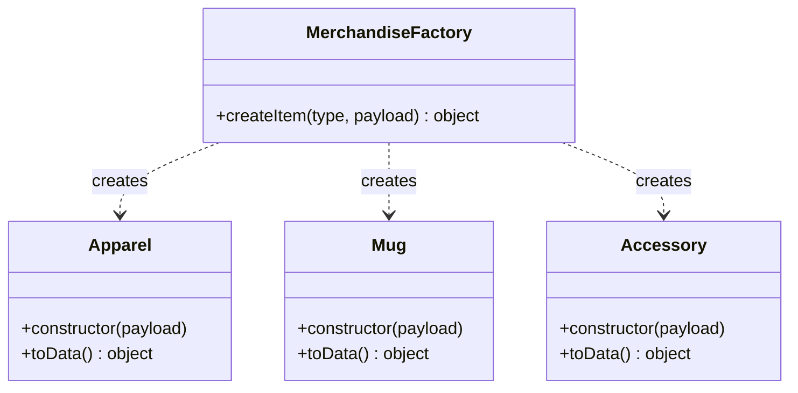

# Factory Pattern — Merchandise Creation

**Where:** `services/catalog-service/factories/MerchandiseFactory.js`, dispatching to `domain/Apparel.js`, `domain/Mug.js`, `domain/Accessory.js`.

## The problem it solves

`POST /api/v1/catalog` accepts one `type` field (`APPAREL` / `MUG` / `ACCESSORY`) plus a payload whose *required* shape differs by type: Apparel must have a non-empty `availableSizes` array or the create should fail outright; Mug always has `availableSizes: []` regardless of what the client sends; Accessory's sizes are optional. Without a factory, that validation and defaulting logic ends up as an `if (type === 'APPAREL') { ... } else if (type === 'MUG') { ... }` block sitting directly inside the route handler in `routes/catalog.js`.

## How it actually works



`MerchandiseFactory.createItem(type, payload)` is a single static method with a `switch` on `type.toUpperCase()`, returning `new Apparel(payload)`, `new Mug(payload)`, or `new Accessory(payload)` — or throwing `Unknown item type` for anything else. The route handler (`routes/catalog.js`, `POST /`) never touches type-specific logic at all:

```js
const domainItem = MerchandiseFactory.createItem(type, { ...rest, clubId });
const item = new Item(domainItem.toData());
await item.save();
```

The validation lives *inside each domain class's constructor*, not in the factory or the route. `Apparel`'s constructor is the one that throws `'APPAREL items must have at least one availableSize'` if `availableSizes` is missing or empty — this is why that specific error message exists at the domain-object level rather than as a route-level `if` check. `Mug`'s constructor hardcodes `this.availableSizes = []` no matter what's in the payload, so a client can't accidentally give a mug sizes by sending them. `toData()` on every domain object just spreads `{ ...this }` — the factory's job ends at "produce a validated plain object," it doesn't know anything about Mongoose or persistence.

## What was rejected, and why

The obvious alternative is exactly the `if/else` chain described above, inlined into the route handler. That was rejected for one concrete reason: it means catalog validation logic (three item types today, more of them if this ever grows) is tangled together with HTTP concerns (status codes, request/response shape) in the same function. The factory + domain-class split means `Apparel`'s size-validation rule can be unit-tested (if this project had unit tests — it currently doesn't, see the repo root README's "what's deliberately not here") completely independent of Express, `req`, or `res`.

## Honest limit

For exactly three item types with this little per-type logic, a factory is arguably more ceremony than the problem strictly needs — a plain `switch` returning validated plain objects (no classes at all) would do the same job with one less layer of indirection. It's a fair pattern to reach for here mainly because the codebase already has more than one place (`MerchandiseFactory` *and* three domain classes) where a fourth item type would need to be wired in consistently — which is exactly the situation a Factory is meant to make safe to extend.
