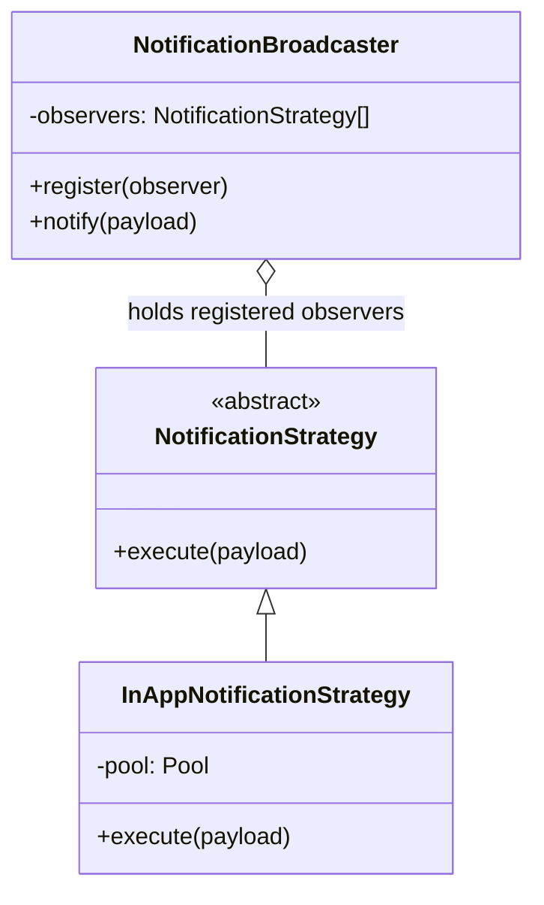
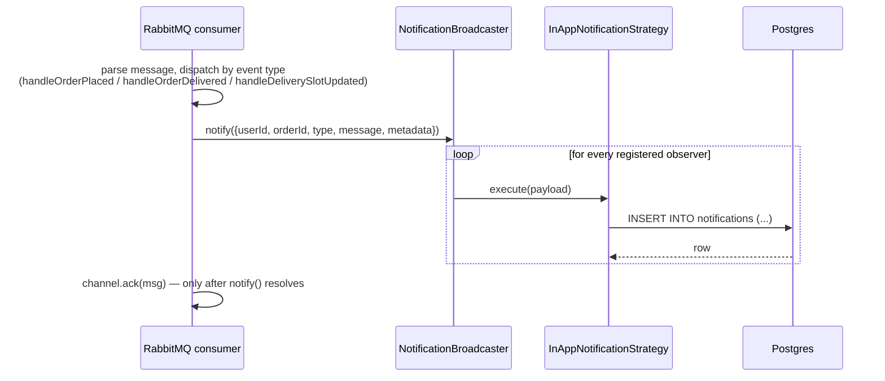

# Strategy + Observer — Notification Dispatch

**Where:** `services/notification-service/observers/NotificationBroadcaster.js` (Observer) and `services/notification-service/strategies/NotificationStrategy.js` + `InAppNotificationStrategy.js` (Strategy). These two patterns are used together here, deliberately — covering them separately would split one connected design in half.

## The problem they solve together

The RabbitMQ consumer in `notification-service/index.js` receives three kinds of events (`order.placed`, `order.delivered`, `delivery.slot.updated`) and needs to turn each into a persisted notification. Today there's exactly one delivery channel (in-app, a Postgres row). The design goal — stated directly in the code comments — is: adding a second channel later (email, WhatsApp) should mean writing one new class, not modifying the RabbitMQ consumer or the event-handling functions at all. That's the Open/Closed Principle, and Strategy + Observer is how it's implemented here.

## How it actually works





`NotificationBroadcaster` is the **Observer** side: it holds a list of registered observers (`register(observer)`) and fans a single `notify(payload)` call out to every one of them (`notify` — Strategy's `execute` and Observer's "notify all subscribers" collapse into the same method here, which is exactly the point of combining the two patterns: the broadcaster doesn't know *how* a notification is delivered, and each strategy doesn't know or care that it's one of possibly several). `NotificationStrategy` is the **Strategy** side: an abstract base class whose `execute(payload)` throws if not overridden, and `InAppNotificationStrategy` is the one concrete implementation registered today, at service startup:

```js
const broadcaster = new NotificationBroadcaster();
broadcaster.register(new InAppNotificationStrategy(pool));
```

The three event handlers (`handleOrderPlaced`, `handleOrderDelivered`, `handleDeliverySlotUpdated`) each build a payload from the RabbitMQ message and call `broadcaster.notify(...)` — none of them ever import or reference `InAppNotificationStrategy` directly. Adding `EmailStrategy` later means one new class implementing `execute(payload)`, plus one line at startup (`broadcaster.register(new EmailStrategy(...))`) — zero changes to `handleOrderPlaced` or the RabbitMQ consumer.

## Why HTTP, not a second RabbitMQ hop, for delivery-slot recipients

`handleDeliverySlotUpdated` needs to know *who* to notify (every student who ordered that item), which Order Service's `orders` table knows and Notification Service doesn't. The chosen design is a direct internal HTTP call (`GET /by-item/:catalogItemId/users` on Order Service) rather than making Order Service a second RabbitMQ publisher/subscriber pair just to answer this one question. This keeps Order Service's only RabbitMQ role as "publish two order events and nothing else" — it doesn't need to know Notification Service exists at all.

## What was rejected, and why

The alternative to Strategy+Observer here is a single `if (message.event === 'order.placed') { /* insert into notifications directly */ }` block inside the RabbitMQ consumer — which is exactly what a first pass at this would look like, and would work fine for exactly one delivery channel. It was rejected because the project's own design docs (`docs/PRD.md`, ADR context) explicitly plan for more channels later; wiring the indirection in now means that's an additive change instead of a refactor.

## Honest limit

With exactly one concrete strategy registered, the abstraction hasn't been exercised by a second implementation yet — the value of Strategy/Observer here is currently more "this is set up correctly for the day a second channel is added" than "this is already paying for itself today." That's a fair and common state for this pattern to be in in a project this size; it's worth being upfront in an interview that the payoff is designed-in, not yet realized.
