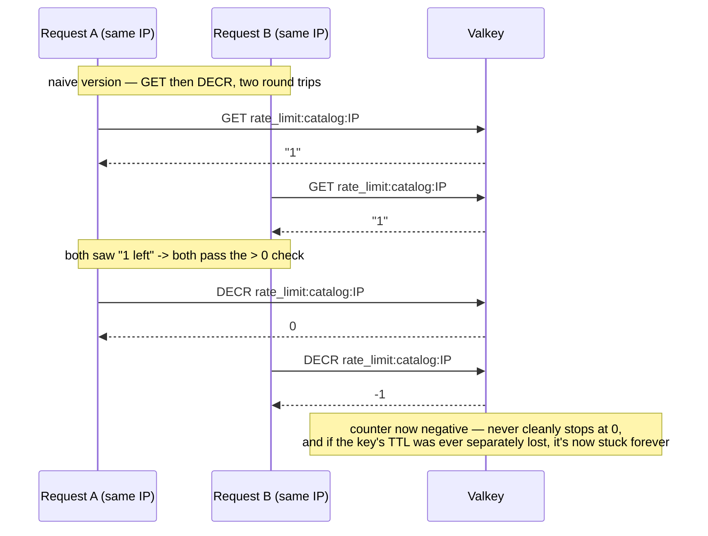

# Token Bucket Rate Limiter

**Where:** `services/api-gateway/middleware/rateLimiter.js`.

## The problem it solves

The gateway needs to throttle two different routes at two different sensitivities: catalog browsing (`GET`, high volume, low risk per-request) and order checkout (`POST`, low volume, high risk per-request — spam or accidental duplicate orders). A per-IP, per-route token bucket backed by Valkey does this and works correctly across however many gateway instances might eventually run, since the counter lives in shared storage rather than a per-process in-memory variable.

## A real bug, found live, not in code review

This bug actually happened during manual testing (`learnings.md` #9), not something spotted by inspection: while testing the Create Item form as a Club Admin, an ordinary request came back `RATE_LIMITED` with no burst of traffic to explain it. Checking Valkey directly: the bucket's counter had gone **negative-or-zero and had no expiry at all** (`PTTL` = -1, meaning "never expires"). Since the code's check (`if (current <= 0)`) never reset a key on its own, and nothing else deleted it, that IP was now rate-limited **permanently**, not just for the intended 60-second window.

**Root cause:** the original limiter was two separate Valkey round-trips — `GET` to read the count, then `DECR` to consume a token — not one atomic operation:



Two concurrent requests from the same IP (very plausible here — multiple browser tabs, the item-detail page's own 10-second stock polling, and manual + automated testing all sharing one machine's IP) could both `GET` the same "1 token left" value before either had `DECR`'d, so both passed the `> 0` check and both decremented — driving the counter below zero instead of stopping cleanly at zero. That explains the negative counter directly. The *missing TTL* is a related but separately-caused symptom, most likely tied to the Valkey connectivity blips this project hit repeatedly during development (see `learnings.md`'s other `ETIMEDOUT`/`EHOSTUNREACH` entries) — but regardless of that part of the story, the check-then-act race itself was real, reproducible, and worth fixing on its own.

## The fix — one atomic Lua script

```lua
local current = redis.call("GET", KEYS[1])
if current == false then
    redis.call("SET", KEYS[1], ARGV[1] - 1, "PX", ARGV[2])
    return {1, tonumber(ARGV[1]) - 1}
end
current = tonumber(current)
if current <= 0 then
    local ttl = redis.call("PTTL", KEYS[1])
    if ttl < 0 then
        redis.call("PEXPIRE", KEYS[1], ARGV[2])
        ttl = tonumber(ARGV[2])
    end
    return {0, current, ttl}
end
redis.call("DECR", KEYS[1])
local ttlAfter = redis.call("PTTL", KEYS[1])
if ttlAfter < 0 then
    redis.call("PEXPIRE", KEYS[1], ARGV[2])
end
return {1, current - 1}
```

This is the same technique as the distributed lock's `LUA_RELEASE_LOCK` (see [distributed-locking.md](../concurrency-control/distributed-locking.md)) — a Lua script runs as one atomic unit on the Valkey server, so no other command can interleave between the read and the decrement. The script also **defensively re-applies the key's TTL on every path** if it's ever found missing (`PTTL < 0`) — this is what actually fixes the "stuck forever" half of the bug, not just the negative-counter half: even if a key somehow loses its expiry again in the future (through some other cause), the very next request through this script self-heals it with a fresh TTL, rather than requiring the earlier bug's exact race to have been the only possible cause of a missing TTL.

Keys are scoped per-route-per-IP (`rate_limit:{name}:{req.ip}`) so `catalogRateLimiter` and `ordersRateLimiter` never share a bucket for the same IP.

**Verified** (`learnings.md` #9): 50 truly concurrent requests (`xargs -P 50`) against a fresh bucket landed at exactly the expected count, not negative; a manually-expired key started a clean new window; a manually-recreated "stuck" key (0, no TTL) self-healed to a fresh TTL on the very next request.

## An honest, factual discrepancy — current vs. originally documented limits

`docs/SECURITY_AND_ACCESS.md` §3.1 documents the intended limits as **100 req/min** for catalog and **5 req/min** for orders, and the code even has inline comments (`// 100`, `// 5`) next to the constructor calls suggesting those were the original targets. **The actual configured constants in the code right now are `createRateLimiter(1000, 60000, 'catalog')` and `createRateLimiter(1000, 60000, 'orders')` — 1000 for both.** This isn't a guess: `learnings.md` #9's own concurrency verification explicitly used "a fresh bucket (limit 1000)," confirming 1000 is the value actually in effect during development and testing, not a stray leftover. The most plausible explanation, based on the comments left in place, is that the limits were loosened during development/testing to avoid tripping the limiter while iterating — but that's inference from the comments, not something confirmed elsewhere in the codebase. Either way: **the mechanism (atomic Lua script, per-route-per-IP keying, self-healing TTL) is correct and battle-tested; the specific threshold values currently differ from what's documented as the intended production target.** See the revision note added to `docs/SECURITY_AND_ACCESS.md` §3.1.

## What was rejected, and why

A simple in-process counter (a plain JS object/`Map` keyed by IP) was never seriously an option once ADR-003 committed to Valkey for locking — reusing the same store for rate limiting avoids introducing a second piece of shared state infrastructure, and a per-process counter would silently reset on every restart and wouldn't work at all if this gateway were ever horizontally scaled.

## Honest limit

The limiter **fails open**: if Valkey is unreachable, the `catch` block logs `REDIS DOWN, SO BYPASSING RATE LIMITING` and calls `next()` — every request is allowed through with zero throttling. This is a deliberate choice (an outage in the rate limiter shouldn't take down the whole API), but it does mean the exact window Valkey is unavailable is also a window with no abuse protection at all.
