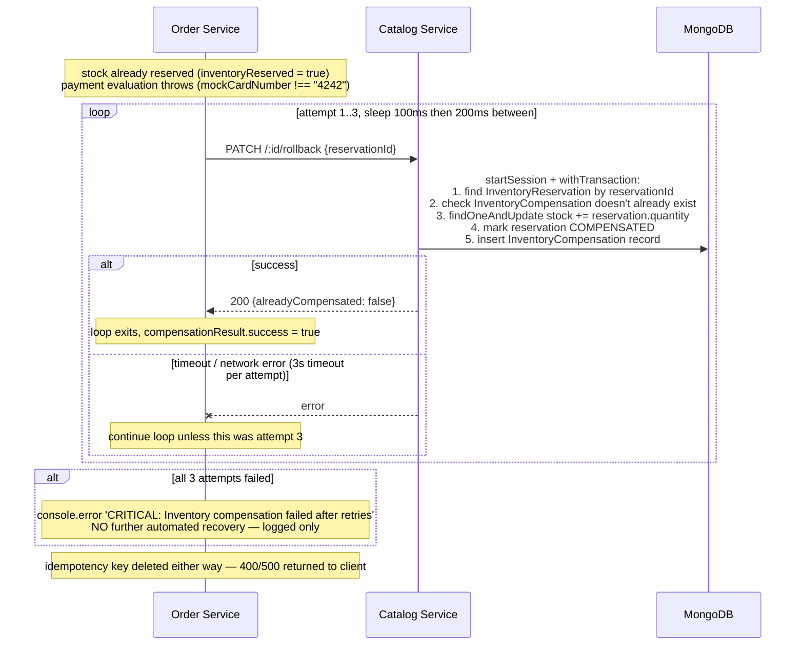

# Saga Rollback

**Where:** the `catch` block in `services/order-service/routes/orders.js` `POST /`, calling `compensateInventory` (`services/order-service/utils/compensateInventory.js`).

## The problem it solves

A checkout touches two databases that don't share a transaction: MongoDB (Catalog Service, stock) and PostgreSQL (Order Service, the order record). The code deliberately reserves stock in Mongo *first*, then evaluates payment, then inserts into Postgres. If payment fails (or any error happens) after the stock reservation succeeds, there's no 2PC to roll both back together — something has to explicitly tell Catalog Service "undo that reservation." That something is the compensating transaction. This is choreography, not orchestration: Order Service directly calls Catalog Service's rollback endpoint when it detects its own failure — there's no separate saga-coordinator service watching both and deciding what to undo.

## How it actually works

The retry loop (`compensateInventory.js`) tries up to 3 times with 100ms then 200ms backoff (`attempt * 100`ms) and a 3-second timeout per attempt. If all 3 fail, the code does exactly one thing: logs `CRITICAL: Inventory compensation failed after retries` and returns `{ success: false }` to the caller, which returns the original error (e.g. `400 PAYMENT_FAILED`) to the client anyway. **There is no dead-letter queue, no manual-intervention ticket, no alerting integration** — "CRITICAL" here means "grep-worthy in the logs," not "someone gets paged." This is a real, acknowledged gap, not an oversight papered over — a fully productionized version of this would need at minimum a way to surface these failures for manual reconciliation.

**Idempotent on the Catalog Service side, deliberately:** the rollback handler checks for an existing `InventoryCompensation` record for the same `reservationId` before touching stock, and a MongoDB unique index on `reservationId` in both `InventoryReservation` and `InventoryCompensation` is the final backstop if two rollback requests for the same reservation somehow race each other. This matters because Order Service's retry loop calls the *same* rollback endpoint repeatedly — without idempotency on the receiving end, a successful-but-slow first attempt followed by a retry could double-restore stock.

## What was rejected, and why

- **Two-phase commit (2PC)** across Postgres and MongoDB was rejected in `docs/ADR.md` (ADR-005) for the standard reason: there's no shared transaction coordinator between a relational and a document database in this stack, and even where 2PC-like support exists, it trades away exactly the kind of loose coupling and independent scaling this project's whole microservices decision (ADR-001) was built around.
- **Orchestration** (a dedicated saga-coordinator service that owns the whole "reserve, then commit or compensate" sequence) was implicitly rejected in favor of choreography — Order Service knows it needs to call Catalog Service's rollback endpoint itself, rather than a third service telling it to. This keeps the moving parts down to two services for a project this size, at the cost of the compensation logic living inside Order Service's own error handling rather than being centrally visible in one place.

## Honest limit

Say this plainly if asked: the saga here is retried and idempotent, but it is **not self-healing past 3 attempts** — a sufficiently persistent Catalog Service outage during exactly the wrong window leaves inventory understated until someone manually reconciles it. That's a reasonable scope cut for a portfolio project's timeline, not a claim that this is production-grade fault tolerance.
